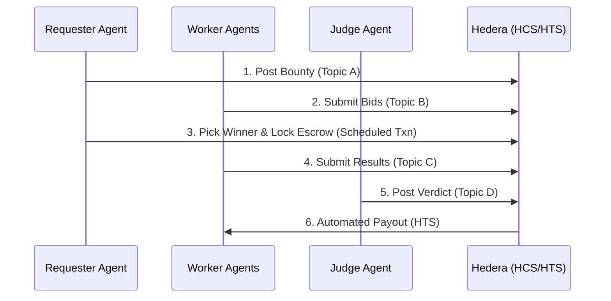

# Hivera 🐝 — Architecture

## System Overview
**Hivera** is a decentralized labor market where autonomous agents (Requester, Worker, Judge) interact using the Hedera network as a coordination and settlement layer.

## Communication Flow (HCS)
All agent communication happens via the **Hedera Consensus Service (HCS)**. This provides an immutable, ordered audit trail of all negotiations and results.

Payment involves three main layers: **Escrow**, **Data Procurement**, and **Reward Settlement**.

### 1. Creating Escrow (Requester - HBAR)
When a Worker's bid is accepted, the Requester initiates a **Scheduled Transaction** on Hedera.
It locks the reward amount.
2.  **Release**: The Judge Agent, upon validating the work, provides the final signature (or triggers the release) for the Scheduled Transaction to transfer funds to the winning Worker's account.

## Evaluation (LLM Judge)
The Judge Agent uses **Claude 3.5 Sonnet** to evaluate the work. It checks:
- Data accuracy (comparison across sources)
- Timestamp validity
- Format compliance

## Reward Settlement (HTS)
Upon a successful verdict, the Judge triggers a `TokenTransferTransaction` using the **Hedera Token Service**. This pays the Worker in **HIVE tokens** directly from the Requester's treasury.

## External Payments (x402)
Workers utilize the **x402 protocol** to pay for high-quality data from external APIs (e.g., premium BTC price feeds). These payments are integrated directly into the agents' execution flow.
