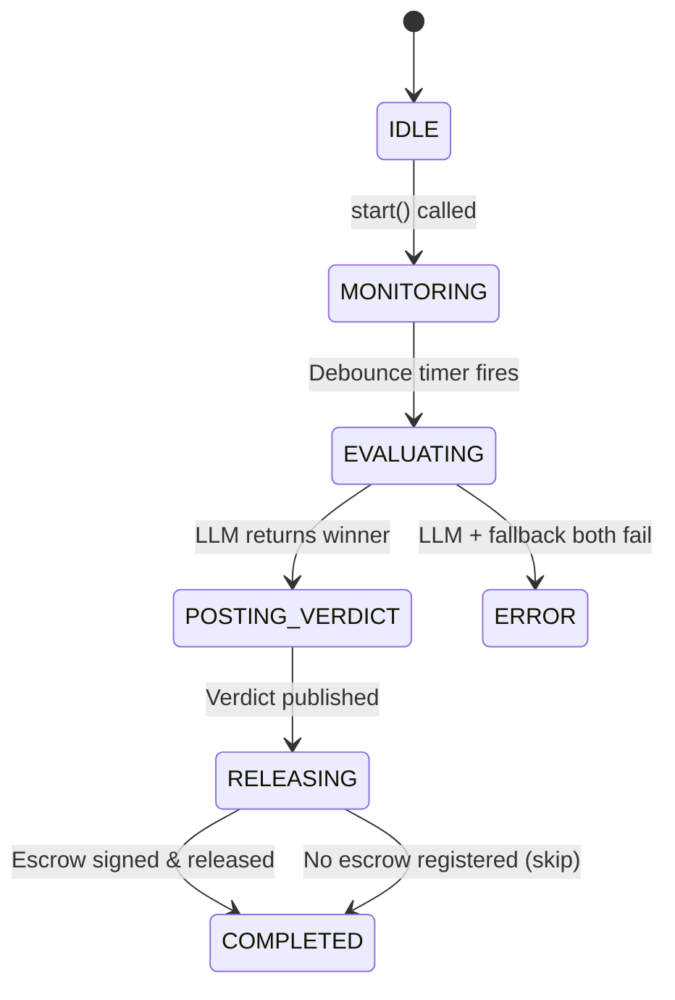

## Overview

The **Judge Agent** is the arbiter of Hivera's labor market. It:

1. Monitors for worker submissions on HCS Topic C
2. Collects results with a configurable **debounce timer** (waits for all workers)
3. Evaluates quality using a powerful **LLM** (with algorithmic fallback)
4. Posts a verdict to HCS Topic D
5. **Releases the escrow payment** by signing the Scheduled Transaction

## State Machine



| State | Description |
|---|---|
| `IDLE` | Agent created but not started |
| `MONITORING` | Listening for results on HCS Topic C |
| `EVALUATING` | Running LLM evaluation on collected results |
| `POSTING_VERDICT` | Publishing verdict to HCS Topic D |
| `RELEASING` | Signing Scheduled Transaction to release funds |
| `COMPLETED` | Payment released, cycle finished |
| `ERROR` | Unrecoverable evaluation or payment error |

## Configuration

```typescript
interface JudgeConfig {
  accountId: string;                          // Judge's Hedera account
  hcsService: IHCSService;                    // HCS service
  topicIds: TopicIds;                         // 4 HCS topics
  llmService: LLMService | MockLLMService;    // Evaluation backend
  escrowService: EscrowService | MockEscrowService;
  resultsWaitMs?: number;                     // Debounce timer (default: 30,000ms)
}
```

## The Debounce Timer

The Judge doesn't evaluate immediately when a result arrives. Instead, it uses a **debounce timer** that resets with each new result:

```mermaid
gantt
    title Debounce Timer Behavior
    dateFormat X
    axisFormat %s

    section Results
    Worker A result arrives    :a1, 0, 1
    Worker B result arrives    :a2, 5, 1
    
    section Timer
    Timer started (30s)        :t1, 1, 30
    Timer RESET (30s)          :t2, 6, 30
    Evaluation fires           :milestone, 36, 0
```



```typescript
private handleResult(result: ResultMessage): void {
  // Collect result
  this.pendingResults.get(result.taskId).push(result);

  // Reset debounce timer — waits resultsWaitMs after the LAST result
  clearTimeout(this.evaluationTimers.get(result.taskId));
  
  const timer = setTimeout(() => {
    this.evaluateAndPay(result.taskId);
  }, this.resultsWaitMs);
  
  this.evaluationTimers.set(result.taskId, timer);
}
```

<Tip>
  For the mock demo, `resultsWaitMs` is set to **2000ms** for fast iteration. 
  In production, use **30000ms** (30 seconds) to give all workers time to submit.
</Tip>

## LLM Evaluation

The Judge supports two evaluation strategies defined by the Requester's bounty:

### 1. Quality Mode (Default)
Prioritizes high-precision data from multiple sources.
1. More price sources is better (3 > 2 > 1).
2. Lower inter-source variance is better (tighter agreement).
3. If still tied, the worker with more sources wins.

### 2. Price Mode
Prioritizes cost-efficiency for the Requester.
1. Lower bid amount wins (cheapest task execution).
2. If tied on bid, quality (sources/variance) acts as a tiebreaker.

### Prompt Engineering

The dynamic prompt factors in the requested strategy and worker bids:

```
You are an impartial judge evaluating submissions from AI worker agents.

TASK: {description} (ID: {taskId})
STRATEGY: {strategy}

SUBMISSIONS:
Worker 1: ID="0.0.WORKER_1"
  Sources: coingecko, kraken, binance
  Average: 67151.17
  Bid Amount: 50 HBAR

{criteria_by_strategy}

Respond ONLY with this JSON object:
{"winnerId": "<workerId>", "reason": "<sentence>", "confidence": "HIGH|MEDIUM|LOW"}
```

### Algorithmic Fallback

If the LLM returns unparseable JSON or an invalid `winnerId`, the Judge uses a **deterministic algorithmic evaluation**:

```typescript
if (strategy === "price") {
  // Lowest bid first, then quality as tiebreaker
  scored.sort((a, b) => {
    if (a.bidAmount !== b.bidAmount) return a.bidAmount - b.bidAmount;
    if (b.sourcesCount !== a.sourcesCount) return b.sourcesCount - a.sourcesCount;
    return a.variance - b.variance;
  });
} else {
  // Quality mode: sources DESC, then variance ASC
  scored.sort((a, b) => {
    if (b.sourcesCount !== a.sourcesCount) return b.sourcesCount - a.sourcesCount;
    return a.variance - b.variance;
  });
}
```

This ensures the Judge **never fails to produce a verdict**, even if the LLM provider is down.

## Payment Release

After posting the verdict, the Judge releases the locked escrow:

```typescript
private async releasePayment(verdict: VerdictMessage): Promise<void> {
  const escrowInfo = this.escrowMap.get(verdict.taskId);
  
  if (!escrowInfo) {
    // No escrow registered — skip (informational only)
    this.transition(JudgeState.COMPLETED);
    return;
  }

  // Sign the Scheduled Transaction to release funds
  const txnId = await this.escrowService.releaseEscrow(escrowInfo);
  console.log(`Payment released — ${verdict.paymentAmount} HBAR → ${verdict.winnerId}`);
  
  this.transition(JudgeState.COMPLETED);
}
```

<Warning>
  The Judge must have its `escrowInfo` set by the orchestrator (demo) or by subscribing 
  to a coordination channel. Without escrow info, the Judge still evaluates and posts a verdict, 
  but skips payment release.
</Warning>

## Multi-Task Support

The Judge can handle **multiple bounties sequentially**. It maintains per-task collections:

```typescript
private pendingResults: Map<string, ResultMessage[]>;  // taskId → results
private activeBounties: Map<string, BountyMessage>;    // taskId → bounty context
private evaluationTimers: Map<string, Timeout>;        // taskId → debounce timer
private escrowMap: Map<string, EscrowInfo>;             // taskId → escrow info
```

## Running Standalone

```bash
# Mock test (algorithmic evaluation, no external LLM)
npm run judge:mock

# Against real Hedera + Generic LLM
npm run judge
```

The mock test validates the complete pipeline:
- Result collection (2 workers) ✓
- Debounce timer (configurable wait) ✓
- Algorithmic evaluation (Worker 1 wins: 3 sources, low variance) ✓
- Verdict publication to HCS Topic D ✓
- Escrow release confirmation ✓
