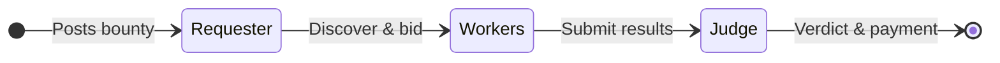

## Agent Model

Hivera follows the **Requester → Worker → Judge** pattern, inspired by real-world freelance marketplaces but fully automated:



Every agent is:

- **Autonomous** — No human input required after startup
- **Stateful** — Implemented as a TypeScript state machine with explicit transitions
- **Testable** — Accepts injected services (mock or real) via constructor
- **Observable** — Logs every state transition to console

## Agent Comparison

| Feature | Requester | Worker | Judge |
|---|---|---|---|
| **State count** | 7 | 7 | 7 |
| **HCS subscriptions** | Bids, Verdicts | Bounties, Verdicts | Bounties, Results |
| **HCS publications** | Bounties | Bids, Results | Verdicts |
| **External calls** | Escrow creation | x402 API calls | LLM evaluation |
| **Hedera services** | HCS, Scheduled Txn | HCS, x402 | HCS, LLM Service, Scheduled Txn |
| **Entry point** | `requester.ts` | `worker.ts` | `judge.ts` |
| **Mock test** | `requester-mock.ts` | `worker-mock.ts` | `judge-mock.ts` |

## Communication Pattern

All inter-agent communication happens via **HCS topics** (Hedera Consensus Service). There is **no direct agent-to-agent communication** — agents are fully decoupled.

```
Requester ──publish──→ [HCS Topic A: Bounties] ──subscribe──→ Workers, Judge
Workers   ──publish──→ [HCS Topic B: Bids]     ──subscribe──→ Requester
Workers   ──publish──→ [HCS Topic C: Results]   ──subscribe──→ Judge
Judge     ──publish──→ [HCS Topic D: Verdicts]  ──subscribe──→ Requester, Workers
```

<Warning>
  HCS messages are **eventually consistent** — there may be a ~3-7 second delay between publishing 
  a message and receiving it via subscription. All agents are designed to handle this asynchrony gracefully.
</Warning>

## Dependency Injection

Each agent accepts its services through a typed configuration object:

```typescript
// Example: WorkerAgent constructor
interface WorkerConfig {
  workerId: string;
  hcsService: IHCSService;       // Real HCS or MockHCS
  paymentSigner: PaymentSigner;  // Real signer or mock
  x402Url: string;
  topicIds: TopicIds;
  bidAmount?: number;
}

// Usage with mocks (demo)
const worker = new WorkerAgent({
  workerId: "0.0.WORKER_1",
  hcsService: new MockHCSService(),
  paymentSigner: createMockPaymentSigner("0.0.WORKER_1"),
  x402Url: "http://localhost:4020/api/v1/btc-price",
  topicIds: TOPIC_IDS,
});

// Usage with real Hedera (production)
const worker = new WorkerAgent({
  workerId: workerConfig.accountId,
  hcsService: new HCSService(hederaClient),
  paymentSigner: createRealPaymentSigner(workerPrivateKey),
  x402Url: "https://api.example.com/btc-price",
  topicIds: loadTopicIds(),
});
```

This pattern enables:
- **Local development** without Hedera credentials
- **Deterministic testing** with predictable mock behavior
- **Gradual migration** from mocks to real services
