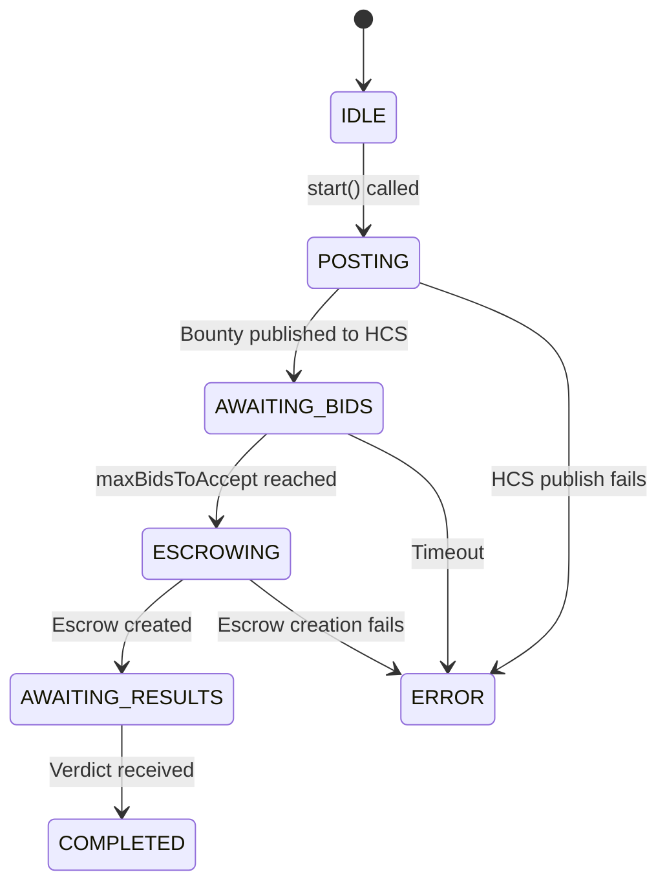

## Overview

The **Requester Agent** is the initiator of every task cycle. It represents an entity that needs work done (e.g., "fetch BTC prices from 3 sources") and is willing to pay for it.

The Requester:
1. Posts a bounty to the HCS bounties topic
2. Creates a Scheduled Transaction escrow to lock reward funds
3. Listens for worker bids and accepts up to N workers
4. Monitors the verdict and marks the task as complete

## State Machine



| State | Description |
|---|---|
| `IDLE` | Agent created but not started |
| `POSTING` | Publishing bounty to HCS Topic A |
| `AWAITING_BIDS` | Listening for bids on HCS Topic B |
| `ESCROWING` | Creating Scheduled Transaction to lock HBAR |
| `AWAITING_RESULTS` | Escrow locked, waiting for Judge verdict |
| `COMPLETED` | Verdict received, task cycle finished |
| `ERROR` | Unrecoverable error occurred |

## Configuration

```typescript
interface RequesterConfig {
  accountId: string;                          // Hedera account ID (e.g., "0.0.12345")
  hcsService: IHCSService;                    // HCS service (real or mock)
  topicIds: TopicIds;                         // 4 HCS topic IDs
  escrowService: EscrowService | MockEscrowService;  // Escrow backend
  maxBidsToAccept?: number;                   // Default: 2
}
```

## Usage

### Starting the Requester

```typescript
const requester = new RequesterAgent({
  accountId: "0.0.REQUESTER",
  hcsService: hcs,
  topicIds: topicIds,
  escrowService: escrow,
  maxBidsToAccept: 2,
});

// Start with bounty parameters
await requester.start({
  taskId: "btc-price-fetch-001",
  description: "Fetch BTC price from 3 sources, return average",
  reward: 100,        // HBAR
  deadline: new Date(Date.now() + 300_000).toISOString(),
});
```

### Querying State

```typescript
requester.getState();        // RequesterState enum
requester.getAcceptedBids(); // BidMessage[] — copy of accepted bids
requester.getEscrowInfo();   // EscrowInfo | null
requester.getErrorReason();  // string | null (if state === ERROR)
```

## How Bid Acceptance Works

The Requester uses a **first-come-first-served** bid acceptance model with a concurrency guard:

```typescript
private handleBid(bid: BidMessage): void {
  // Guard 1: Only accept bids in AWAITING_BIDS state
  if (this.state !== RequesterState.AWAITING_BIDS) return;

  // Guard 2: Ignore bids for other tasks
  if (bid.taskId !== this.currentBounty.taskId) return;

  // Guard 3: Already have enough bids (prevents race condition)
  if (this.acceptedBids.length >= this.maxBidsToAccept || this.isEscrowing) return;

  this.acceptedBids.push(bid);

  // When N bids are collected, lock escrow
  if (this.acceptedBids.length >= this.maxBidsToAccept) {
    this.isEscrowing = true;  // Concurrency guard
    this.lockEscrow();
  }
}
```

<Warning>
  The `isEscrowing` flag prevents double-escrow creation when multiple bids arrive 
  simultaneously through the HCS subscription handler.
</Warning>

## Escrow Creation

When enough bids are accepted, the Requester creates a **Hedera Scheduled Transaction**:

1. Builds a `TransferTransaction` (sender → recipient)
2. Wraps it in a `ScheduleCreateTransaction`
3. The schedule stays in `PENDING` state until the Judge signs it

```typescript
const innerTransfer = new TransferTransaction()
  .addHbarTransfer(senderAccountId, new Hbar(-amountHbar))
  .addHbarTransfer(recipientAccountId, new Hbar(amountHbar));

const response = await new ScheduleCreateTransaction()
  .setScheduledTransaction(innerTransfer)
  .setScheduleMemo(`Hivera escrow — ${taskId}`)
  .execute(client);
```

<Info>
  The escrow recipient is initially set to the **first accepted bidder**. 
  The Judge determines the actual winner and releases payment accordingly.
</Info>

## Running Standalone

```bash
# Against real Hedera (requires .env)
npm run requester

# Mock test (no external deps)
npm run requester:mock
```

The mock test validates the complete lifecycle:
- Bounty publication ✓
- Bid acceptance (2 bids) ✓
- Escrow creation ✓
- Excess bid rejection ✓
- Verdict handling ✓
