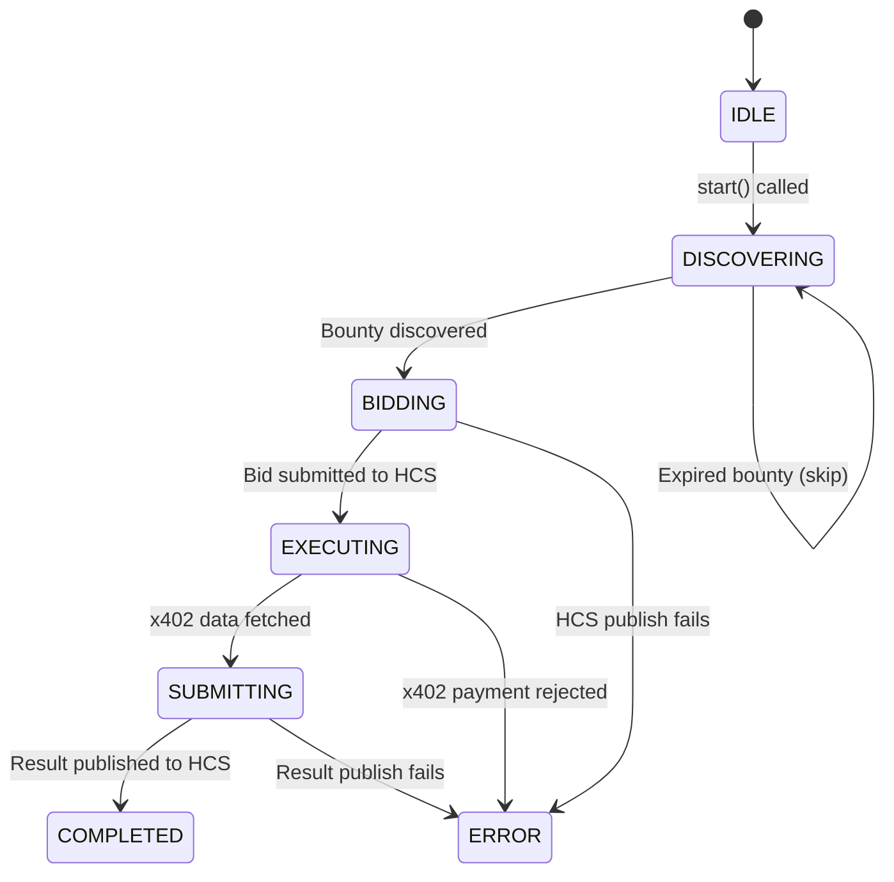
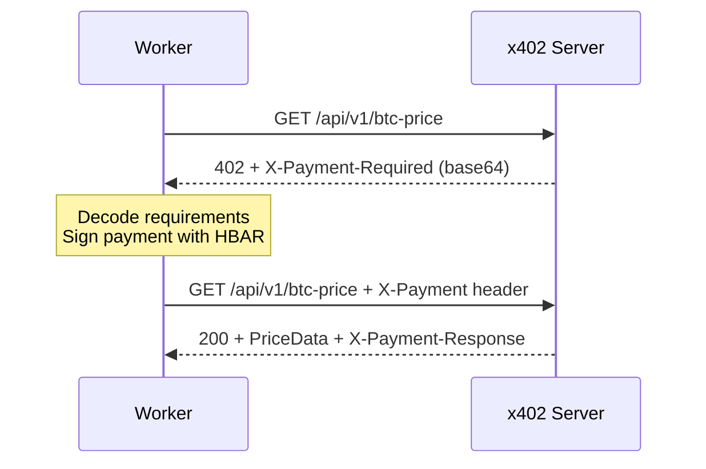

## Overview

The **Worker Agent** is the economic engine of Hivera. It autonomously:

1. Discovers bounties by subscribing to HCS Topic A
2. Evaluates profitability and submits bids to HCS Topic B
3. Pays for external data via the **x402 protocol** (HTTP 402 payment flow)
4. Aggregates data from multiple price sources
5. Submits results to HCS Topic C for the Judge to evaluate

## State Machine



| State | Description |
|---|---|
| `IDLE` | Agent created but not started |
| `DISCOVERING` | Listening for bounties on HCS Topic A |
| `BIDDING` | Submitting a bid to HCS Topic B |
| `EXECUTING` | Calling x402 API to fetch BTC prices |
| `SUBMITTING` | Publishing result to HCS Topic C |
| `COMPLETED` | Result submitted, awaiting verdict |
| `ERROR` | Unrecoverable error occurred |

## Configuration

```typescript
interface WorkerConfig {
  workerId: string;            // Hedera account ID (e.g., "0.0.51234")
  hcsService: IHCSService;     // HCS service (real or mock)
  paymentSigner: PaymentSigner; // x402 payment signer
  x402Url: string;             // x402 API endpoint URL
  topicIds: TopicIds;          // 4 HCS topic IDs
  bidAmount?: number;          // HBAR bid amount (default: 50)
}
```

## Core Flow

### 1. Bounty Discovery

When a `BountyMessage` arrives on HCS Topic A, the Worker validates it:

```typescript
private handleBounty(bounty: BountyMessage): void {
  // Only process if we're in DISCOVERING state (not busy)
  if (this.state !== WorkerState.DISCOVERING) return;

  // Check deadline hasn't passed
  const deadline = new Date(bounty.deadline);
  if (deadline.getTime() < Date.now()) return;

  // Process the bounty
  this.processBounty(bounty);
}
```

<Info>
  A Worker only handles **one bounty at a time**. If it's already executing a task, 
  new bounties are ignored until the current one completes.
</Info>

### 2. Bid Submission

The Worker publishes a `BidMessage` with its offer:

```json
{
  "type": "bid",
  "taskId": "btc-price-fetch-001",
  "workerId": "0.0.51234",
  "bidAmount": 50,
  "estimatedTime": "30s"
}
```

### 3. x402 Task Execution

This is the **critical path** — the Worker pays for external data using the x402 protocol:



The `fetchWithPayment()` function handles the full 402 flow:

```typescript
// Step 1: Initial request (no payment)
const response = await fetch(url);

// Step 2: If 402, parse requirements from header
const requirements = decodeBase64(
  response.headers.get("x-payment-required")
);

// Step 3: Sign payment
const payment = await paymentSigner(requirements);

// Step 4: Retry with payment proof
const paidResponse = await fetch(url, {
  headers: { "X-Payment": encodeBase64(payment) }
});

// Step 5: Return price data + payment confirmation
return { priceData, paymentResponse };
```

### 4. Result Submission

The Worker publishes its aggregated result to HCS Topic C:

```json
{
  "type": "result",
  "taskId": "btc-price-fetch-001",
  "workerId": "0.0.51234",
  "data": {
    "sources": ["coingecko", "kraken", "binance"],
    "prices": [67150.00, 67155.30, 67148.20],
    "average": 67151.17
  }
}
```

### 5. Verdict Monitoring

After submission, the Worker listens for the verdict:

```typescript
private handleVerdict(verdict: VerdictMessage): void {
  if (verdict.winnerId === this.workerId) {
    console.log(`🏆 WON bounty! Payment: ${verdict.paymentAmount} HBAR`);
  } else {
    console.log(`Lost bounty — winner: ${verdict.winnerId}`);
  }
}
```

## Multi-Worker Competition

Hivera supports **multiple competing Workers**. In the demo, workers are instantiated with different IDs:

```typescript
const worker1 = new WorkerAgent({ workerId: "0.0.WORKER_1", ... });
const worker2 = new WorkerAgent({ workerId: "0.0.WORKER_2", ... });

await worker1.start();
await worker2.start();
// Both discover the same bounty, both bid, both submit results.
// The Judge picks the best one.
```

The Judge evaluates based on:
1. **Number of price sources** (more is better)
2. **Variance between sources** (lower is better — more trustworthy)

## Running Standalone

```bash
# Mock test (with local x402 server)
npm run worker:mock

# Against real Hedera
npm run worker
```

The mock test validates:
- State transitions (IDLE → DISCOVERING → BIDDING → EXECUTING → SUBMITTING → COMPLETED) ✓
- x402 payment flow (402 → sign → retry → 200) ✓
- Bid and result publication to correct HCS topics ✓
- Verdict handling (win notification) ✓
