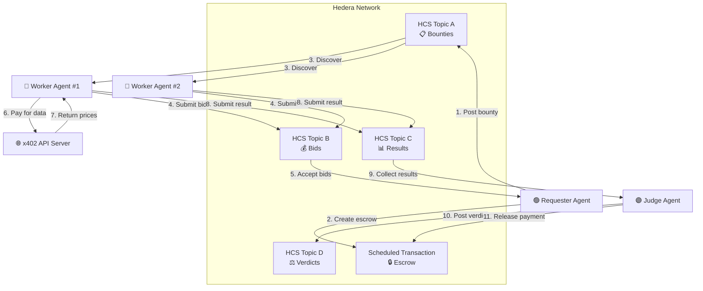
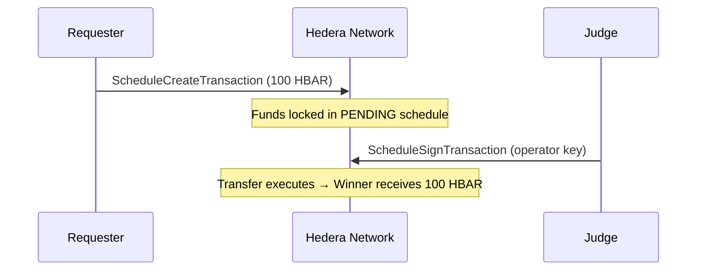
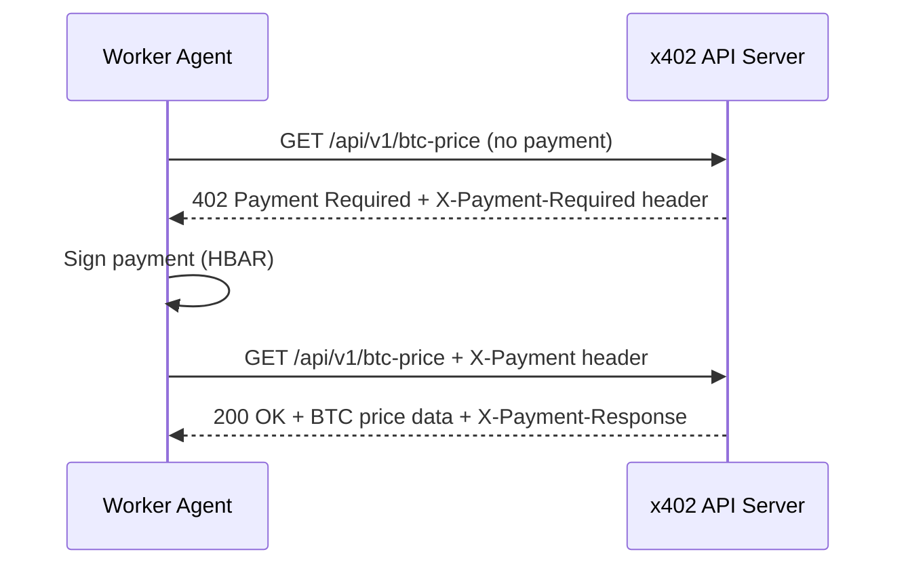

## System Overview

Hivera implements a **three-tier autonomous labor market** where agents coordinate entirely through Hedera Consensus Service (HCS) message topics. No centralized server, no API gateway — just agents publishing and subscribing to on-chain topics.



## The Three Agents

### 🟢 Requester Agent

The **employer** in the labor market. It initiates the entire cycle.

| Responsibility | How |
|---|---|
| Define task requirements | Posts a `BountyMessage` to HCS Topic A |
| Lock reward funds | Creates a Hedera Scheduled Transaction (escrow) |
| Accept worker bids | Subscribes to HCS Topic B, accepts up to N bids |
| Monitor completion | Listens for verdict on HCS Topic D |

### 🔵 Worker Agent(s)

The **contractors** that compete for bounties and execute tasks.

| Responsibility | How |
|---|---|
| Discover bounties | Subscribes to HCS Topic A |
| Submit competitive bids | Publishes `BidMessage` to HCS Topic B |
| Execute the task | Calls external APIs via x402 protocol (pays with HBAR) |
| Submit results | Publishes `ResultMessage` to HCS Topic C |

### 🟣 Judge Agent

The **impartial evaluator** that decides who gets paid.

| Responsibility | How |
|---|---|
| Monitor submissions | Subscribes to HCS Topic C with a debounce timer |
| Evaluate quality | Calls the LLM Service (or algorithmic fallback) to pick a winner |
| Post verdict | Publishes `VerdictMessage` to HCS Topic D |
| Release payment | Signs the Scheduled Transaction to release escrow funds |

## HCS Topic Architecture

Hivera uses **4 dedicated HCS topics**, each serving as a typed message bus:

| Topic | Message Type | Publisher | Subscribers |
|---|---|---|---|
| **Topic A** (Bounties) | `BountyMessage` | Requester | Workers, Judge |
| **Topic B** (Bids) | `BidMessage` | Workers | Requester |
| **Topic C** (Results) | `ResultMessage` | Workers | Judge |
| **Topic D** (Verdicts) | `VerdictMessage` | Judge | Requester, Workers |

<Info>
  All messages are JSON-encoded and transmitted as UTF-8 bytes via HCS `TopicMessageSubmitTransaction`. 
  Each message includes a `type` discriminator field for safe parsing.
</Info>

## Payment Architecture

Hivera implements a **two-layer payment system**:

### Layer 1: Escrow (HBAR ↔ Scheduled Transactions)

The Requester locks HBAR in a Hedera Scheduled Transaction when workers are accepted. The Judge signs the schedule to release funds to the winner.



### Layer 2: x402 (Worker ↔ External APIs)

Workers pay for external data using the x402 HTTP payment protocol:



## Project Structure

```
ethglobal2026/
├── src/
│   ├── agents/                   # Agent state machines
│   │   ├── requester.ts          # Requester: bounty + escrow + bid acceptance
│   │   ├── worker.ts             # Worker: discovery + x402 + result submission
│   │   ├── judge.ts              # Judge: evaluation + verdict + payment release
│   │   ├── requester-mock.ts     # Requester standalone test
│   │   ├── worker-mock.ts        # Worker standalone test
│   │   └── judge-mock.ts         # Judge standalone test
│   ├── services/                 # Shared infrastructure
│   │   ├── hcs.ts                # HCS publish/subscribe (real + mock)
│   │   ├── escrow.ts             # Scheduled Transaction escrow (real + mock)
│   │   ├── llm.ts                # LLM evaluation (real + mock)
│   │   ├── x402-client.ts        # x402 payment client
│   │   ├── price-fetcher.ts      # Multi-source BTC price aggregation
│   │   └── logger.ts             # Winston logger
│   ├── config/
│   │   └── hedera.ts             # Hedera client factory + env loading
│   ├── types/
│   │   └── index.ts              # All TypeScript interfaces & enums
│   ├── scripts/
│   │   └── create-topics.ts      # One-time HCS topic creation
│   ├── x402-mock-server/
│   │   └── server.ts             # Express-based x402 mock API
│   ├── cli/
│   │   └── output.ts             # Terminal formatting (chalk)
│   ├── demo.ts                   # Full integrated orchestrator
│   └── __tests__/                # Jest test suite
├── docs/                         # Markdown documentation
├── .env.example                  # Environment variable template
├── package.json
├── tsconfig.json
└── jest.config.js
```

## Design Principles

<AccordionGroup>
  <Accordion title="Mock-first development">
    Every service has both a real implementation (Hedera SDK) and a mock implementation (in-memory). 
    This enables local development without any external dependencies and makes testing deterministic.
  </Accordion>
  <Accordion title="State machine architecture">
    Each agent is implemented as an explicit state machine with well-defined transitions 
    (`IDLE → DISCOVERING → BIDDING → EXECUTING → COMPLETED`). This makes behavior predictable 
    and debugging straightforward.
  </Accordion>
  <Accordion title="Dependency injection">
    Agents receive their services (HCS, Escrow, LLM) via constructor injection. The demo orchestrator
    wires mock services; the CLI entrypoints wire real Hedera services. Same agent code, different backends.
  </Accordion>
  <Accordion title="Graceful degradation">
    The LLM service falls back to an algorithmic evaluator if the LLM provider returns unparseable JSON. 
    The price fetcher requires only 2 of 3 sources to succeed. The x402 server uses a hardcoded 
    fallback if live APIs are unavailable.
  </Accordion>
</AccordionGroup>
