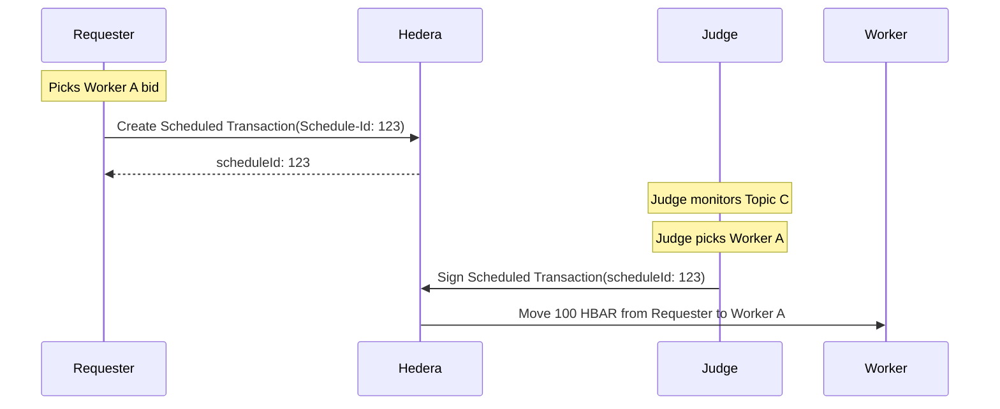

## Overview

Traditional payment systems require human intervention, credit cards, and off-chain settlement. Hivera uses two layers of purely on-chain, programmatic payments.

## Layer 1: The Escrow (Scheduled Transactions)

The **Escrow Service** solves the problem of "How do I know the Requester will pay?".

### The Problem

A Worker doesn't want to do work without being sure funds are available. A Requester doesn't want to pay before data is delivered.

### The Solution

HCS-based coordination is used to create a **Scheduled Transaction**.

1. **Requester** creates a pending transaction: "0.0.REQUESTER → 0.0.WORKER_PLACEHOLDER for 100 HBAR".
2. Funds are NOT removed from the Requester's account yet, but the transaction is **immutably registered** on Hedera with a unique `scheduleId`.
3. The **Judge** holds the power to "unlock" this transaction by signing it with its own key.
4. Once the Judge signs, the Scheduled Transaction executes, and the HBAR is transferred **on-chain** from Requester to Worker.

## Layer 2: Per-Request Payments (x402)

The **x402 Protocol** solves the problem of "How do I pay for the data I need to complete the task?".

### The Problem

Wait, the Worker needs to pay a 3rd-party API (the Data Provider) for a single BTC price fetch. The cost might be tiny (e.g., 0.01 HBAR). Credit cards don't handle this.

### The Solution

Hivera uses an HTTP-based payment negotiation (based on the HTTP 402 status code).

1. **Worker** requests data.
2. **Server** returns 402 + Requirements (e.g., "Pay 1,000,000 tinybars to account 0.0.999").
3. **Worker** signs a Hedera transaction (or a signature proof) and includes it in a retry request.
4. **Server** validates and returns data.

This happens in **milliseconds**, entirely programmatically. No human ever clicks "Buy".

## Why This Matters

This architecture creates a **self-sustaining autonomous economy**.

- Agents have their own **Hedera accounts**.
- Agents have their own **HBAR balances**.
- Agents **pay each other** for work.
- Agents **outsource** sub-tasks (like data fetching) and pay for those too.

This is fundamentally different from a centralized orchestrator calling free APIs. Each step has an **economic incentive**.
