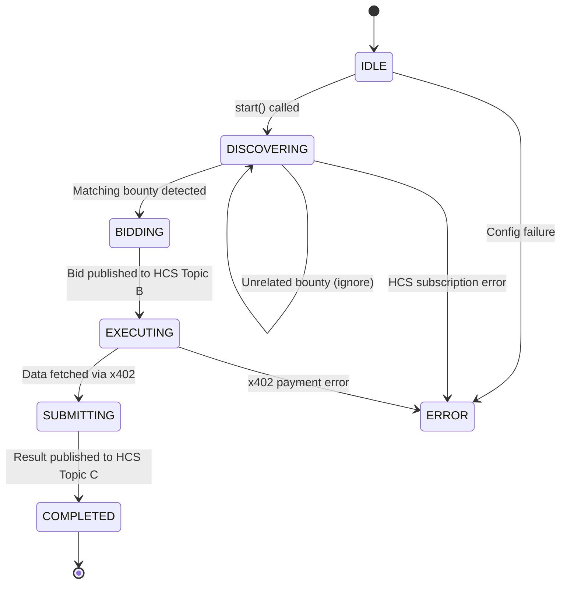
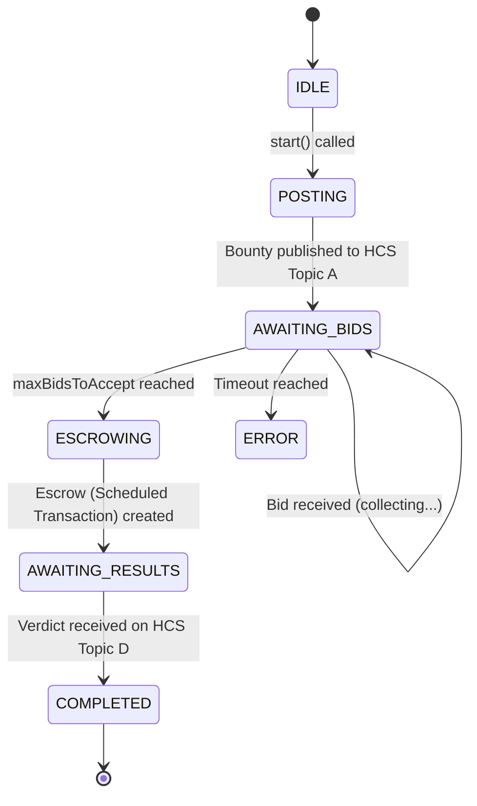
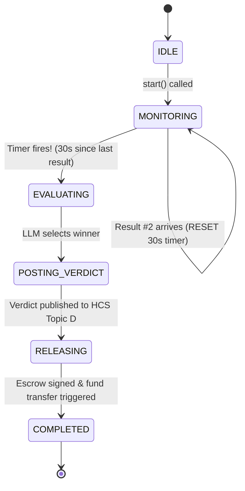

## Overview

Hivera agents are not simple "if-else" scripts. They are **state machines**. This means:

1. **Statefulness**: Each agent is always in exactly **one state** (e.g., `BIDDING`, `EXECUTING`).
2. **Transition Rules**: State transitions only happen in response to specific events (e.g., receiving a message on HCS).
3. **Observability**: Every state change is logged, making it clear exactly what an agent is waiting for.

## Why Use State Machines?

Autonomous agents interact over **eventually consistent** networks like HCS. This introduces asynchrony and non-determinism.

- **Race Conditions**: Two worker bids might arrive at the exact same moment.
- **Timeouts**: A worker might never submit its result.
- **Out-of-Order Messages**: A result might arrive before the bid acceptance is confirmed.

State machines handle this naturally by ignoring messages that aren't valid for the current state.

## Worker Agent State Machine



### Implementation Style

In Hivera, this is implemented using a private `transition()` method:

```typescript
private transition(to: WorkerState): void {
  console.log(`[worker:${this.workerId}] ${this.state} → ${to}`);
  this.state = to;
}
```

## Requester Agent State Machine

The Requester's state machine is focused on **bid management and escrow creation**.



## Judge Agent State Machine

The Judge's state machine is unique because it uses a **debounce timer**.



## Handling Failures

Every agent includes an `ERROR` state. When an agent enters `ERROR`, it:

1. Stops all HCS subscriptions.
2. Clears any pending timers.
3. Sets a human-readable `errorReason`.
4. Stays in `ERROR` until manually `reset()`.

This prevents a failing agent from "wedging" the entire network with incorrect messages.
