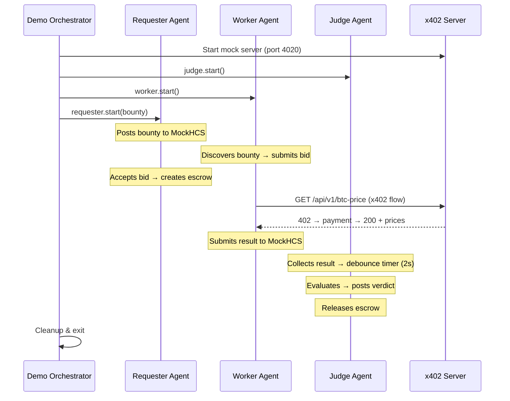

## Quick Run

```bash
npm run demo
```

That's it. The demo runs entirely locally using mock services. No Hedera account, no API keys, no external dependencies.

## What Happens

The demo script (`src/demo.ts`) orchestrates all three agents with mock backends:



## Stage-by-Stage Breakdown

### Stage 1: Posting Bounty

The Requester agent publishes a bounty to the mock HCS bounties topic:

```
[STAGE 1] POSTING BOUNTY (Requester)
[requester:0.0.REQUESTER] IDLE → POSTING
[mock-hcs] Published bounty to 0.0.BOUNTIES
[requester:0.0.REQUESTER] POSTING → AWAITING_BIDS

  BOUNTY POSTED
  ────────────────────────────────────────
  Task ID   : btc-price-fetch-demo
  Reward    : 100 HBAR
  Deadline  : 2026-04-04T14:05:00Z
```

### Stage 2: Negotiation

The Worker receives the bounty and submits a bid. The Requester accepts and creates escrow:

```
[STAGE 2] AGENT NEGOTIATION & BIDDING
[worker:0.0.WORKER_1] IDLE → DISCOVERING
[worker:0.0.WORKER_1] Found bounty: btc-price-fetch-demo — 100 HBAR
[worker:0.0.WORKER_1] DISCOVERING → BIDDING
[mock-hcs] Published bid to 0.0.BIDS
[requester:0.0.REQUESTER] Accepted bid 1/1 from 0.0.WORKER_1

  ✔ Winner selected & Escrow locked!
```

### Stage 3: Execution

The Worker calls the x402 mock server, pays for BTC prices, and submits its result:

```
[STAGE 3] AGENT EXECUTION & X402 PAYMENT
[worker:0.0.WORKER_1] BIDDING → EXECUTING
[x402-client] Payment required: 1000000 HBAR to 0.0.MOCK_PAYEE
[x402-client] Mock signing payment
[x402-client] Payment accepted — txn: mock-txn-WORKER_1
[worker:0.0.WORKER_1] Got prices from kraken, binance — avg $67,154.45
[worker:0.0.WORKER_1] EXECUTING → SUBMITTING → COMPLETED

  WORK RESULT SUBMITTED
  ────────────────────────────────────────
  Worker ID  : 0.0.WORKER_1
  Average    : $67,154.45
  Sources    : kraken, binance
```

### Stage 4: Evaluation & Payment

The Judge evaluates the submission and releases escrow:

```
[STAGE 4] JUDGE EVALUATION & PAYMENT
[judge:0.0.JUDGE] MONITORING → EVALUATING
[mock-llm] Winner: 0.0.WORKER_1 — "Most price sources with lowest variance"
[judge:0.0.JUDGE] EVALUATING → POSTING_VERDICT
[judge:0.0.JUDGE] POSTING_VERDICT → RELEASING
[mock-escrow] Released schedule — 100 HBAR → 0.0.WORKER_1
[judge:0.0.JUDGE] RELEASING → COMPLETED

  JUDGE VERDICT
  ────────────────────────────────────────
  Winner    : 0.0.WORKER_1
  Reason    : Most price sources with lowest variance
  Payout    : 100 HBAR
  ✔ Transaction Completed

✔ The full multi-agent cycle was completed successfully on Hedera!
```

## Running Individual Agent Mocks

Each agent also has a standalone mock test that validates its complete lifecycle:

```bash
npm run worker:mock     # Worker: bounty → bid → x402 → result → verdict
npm run requester:mock  # Requester: bounty → bids → escrow → verdict
npm run judge:mock      # Judge: results → evaluation → verdict → payment
```

These are useful for debugging individual agents in isolation.
