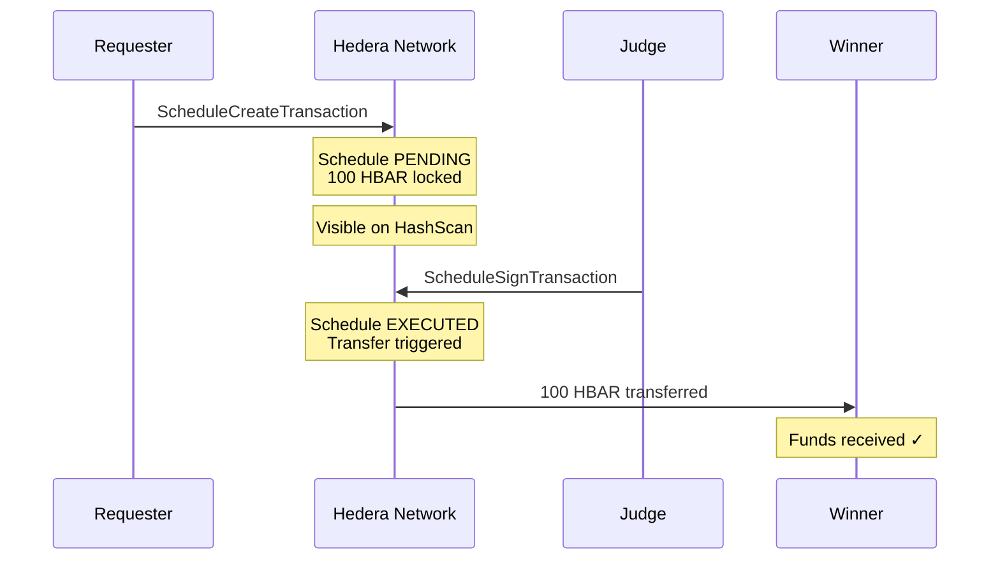

## Overview

The Escrow Service implements **trustless fund locking** using Hedera Scheduled Transactions. This is the financial guarantee layer of Hivera:

- **Requester** creates an escrow when accepting bids → funds are locked
- **Judge** releases the escrow after evaluating results → funds transfer to winner

No centralized intermediary. No custody risk. The escrow lives on-chain.

## Interface

```typescript
interface EscrowInfo {
  scheduleId: string;        // Hedera schedule ID (e.g., "0.0.98765")
  taskId: string;            // Task this escrow is for
  amount: number;            // HBAR locked
  recipientAddress: string;  // Winner's Hedera account
}
```

## Real Implementation (`EscrowService`)

### Creating an Escrow

```typescript
async createEscrow(
  taskId: string,
  senderAccountId: string,
  recipientAccountId: string,
  amountHbar: number,
): Promise<EscrowInfo> {
  // Build the inner HBAR transfer
  const innerTransfer = new TransferTransaction()
    .addHbarTransfer(AccountId.fromString(senderAccountId), new Hbar(-amountHbar))
    .addHbarTransfer(AccountId.fromString(recipientAccountId), new Hbar(amountHbar));

  // Wrap in a Scheduled Transaction — does NOT auto-execute
  const response = await new ScheduleCreateTransaction()
    .setScheduledTransaction(innerTransfer)
    .setScheduleMemo(`Hivera escrow — ${taskId}`)
    .execute(this.client);

  const receipt = await response.getReceipt(this.client);
  const scheduleId = receipt.scheduleId!.toString();

  return { scheduleId, taskId, amount: amountHbar, recipientAddress: recipientAccountId };
}
```

### Releasing an Escrow

```typescript
async releaseEscrow(info: EscrowInfo): Promise<string> {
  // Sign the schedule → triggers the TransferTransaction
  const response = await new ScheduleSignTransaction()
    .setScheduleId(ScheduleId.fromString(info.scheduleId))
    .freezeWith(this.client)
    .sign(this.operatorKey)
    .then((tx) => tx.execute(this.client));

  await response.getReceipt(this.client);
  return response.transactionId.toString();
}
```

## How Scheduled Transactions Work



<Info>
  **Scheduled Transactions** are a unique Hedera feature. They allow creating a transaction 
  that only executes when enough parties sign it. Hivera uses this as an escrow: the Requester 
  creates it, and the Judge's signature releases the funds.
</Info>

## Mock Implementation (`MockEscrowService`)

For local development, the mock tracks escrow state in memory:

```typescript
class MockEscrowService {
  private releasedIds = new Set<string>();
  private mockScheduleCounter = 1000;

  async createEscrow(...): Promise<EscrowInfo> {
    const scheduleId = `0.0.MOCK_SCHEDULE_${this.mockScheduleCounter++}`;
    return { scheduleId, taskId, amount, recipientAddress };
  }

  async releaseEscrow(info: EscrowInfo): Promise<string> {
    this.releasedIds.add(info.scheduleId);
    return `mock-txn-${Date.now()}`;
  }

  // Test assertion helper
  isReleased(scheduleId: string): boolean {
    return this.releasedIds.has(scheduleId);
  }
}
```

## Verification on HashScan

After creating an escrow on Hedera Testnet, you can verify it at:

```
https://hashscan.io/testnet/schedule/{scheduleId}
```

This shows:
- The schedule's status (`PENDING` or `EXECUTED`)
- The inner transfer details (sender, recipient, amount)
- Which keys have signed
- The execution timestamp
