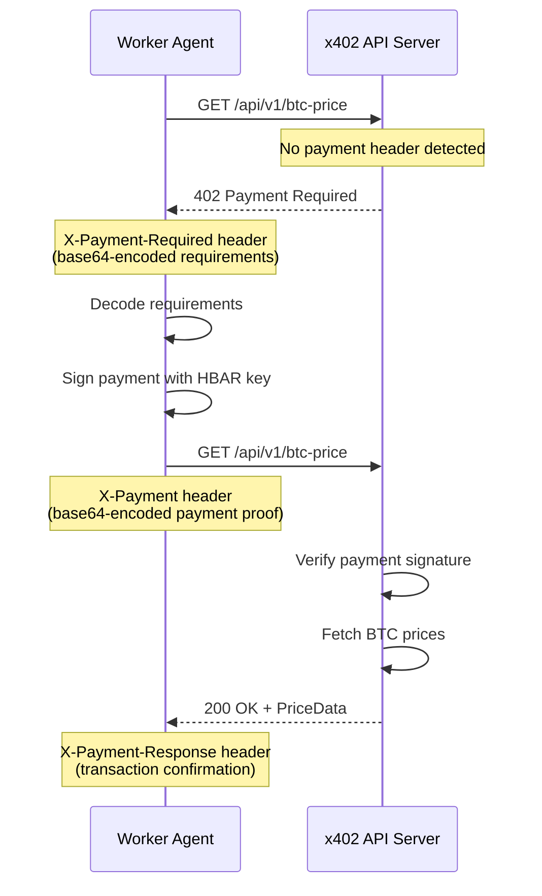

## Overview

The **x402 protocol** enables machine-to-machine payments over HTTP. When a Worker requests data from a paid API:

1. The server responds with **HTTP 402 Payment Required**
2. The response includes payment requirements in the `X-Payment-Required` header
3. The Worker signs a payment and retries with the proof in the `X-Payment` header
4. The server verifies payment and returns the data

This is how autonomous agents pay for premium data **without human authorization or credit cards**.

## Protocol Flow



## Payment Requirements

When the server responds with 402, it includes requirements in a base64-encoded header:

```typescript
interface X402PaymentRequirements {
  x402Version: number;        // Protocol version (currently 2)
  accepts: X402AcceptedPayment[];
}

interface X402AcceptedPayment {
  scheme: string;    // "exact" — exact amount required
  network: string;   // "hedera:testnet" — target network
  asset: string;     // "HBAR" — payment asset
  amount: string;    // "1000000" — tinybars (0.01 HBAR)
  payTo: string;     // "0.0.XXXXX" — recipient account
}
```

**Example** (decoded from base64):

```json
{
  "x402Version": 2,
  "accepts": [{
    "scheme": "exact",
    "network": "hedera:testnet",
    "asset": "HBAR",
    "amount": "1000000",
    "payTo": "0.0.MOCK_PAYEE"
  }]
}
```

## Payment Proof

The Worker signs a payment and sends it as a base64-encoded header:

```typescript
interface X402PaymentPayload {
  x402Version: number;
  scheme: string;
  payload: {
    signature: string;       // Signed payment proof
    transactionId?: string;  // Optional: Hedera transaction ID
  };
}
```

## Client Implementation

### `fetchWithPayment()`

The main client function handles the full 402 negotiation:

```typescript
async function fetchWithPayment(
  url: string,
  paymentSigner: PaymentSigner,
): Promise<{ priceData: PriceData; paymentResponse: X402PaymentResponse }> {
  // Step 1: Try without payment
  const initialResponse = await fetch(url);
  
  if (initialResponse.ok) {
    // Data is free!
    return { priceData: await initialResponse.json(), ... };
  }
  
  if (initialResponse.status !== 402) {
    throw new Error(`Unexpected status: ${initialResponse.status}`);
  }
  
  // Step 2: Parse requirements
  const requirements = decodeBase64(
    initialResponse.headers.get("x-payment-required")
  );
  
  // Step 3: Sign payment
  const payment = await paymentSigner(requirements);
  
  // Step 4: Retry with payment
  const paidResponse = await fetch(url, {
    headers: { "X-Payment": encodeBase64(payment) }
  });
  
  // Step 5: Return data + payment confirmation
  return { priceData, paymentResponse };
}
```

### `PaymentSigner` Type

```typescript
type PaymentSigner = (
  requirements: X402PaymentRequirements,
) => Promise<X402PaymentPayload>;
```

### Mock Payment Signer

For local testing:

```typescript
function createMockPaymentSigner(workerId: string): PaymentSigner {
  return async (requirements) => ({
    x402Version: requirements.x402Version,
    scheme: requirements.accepts[0].scheme,
    payload: {
      signature: `mock-payment-${workerId}-${Date.now()}`,
      transactionId: `mock-txn-${workerId}-${Date.now()}`,
    },
  });
}
```

## Mock Server

Hivera includes a full **x402 mock server** (`src/x402-mock-server/server.ts`) that:

- Responds with 402 when no payment header is present
- Validates the payment payload structure
- Fetches **real BTC prices** from CoinGecko, Kraken, and Binance
- Falls back to hardcoded prices if APIs are unavailable

```bash
npm run x402-server
# [x402-server] Running on http://localhost:4020
# Endpoints:
#   GET /health           — Health check
#   GET /api/v1/btc-price — x402-protected BTC price
```

## Timeout Handling

All x402 requests have a **30-second timeout** via `AbortController`:

```typescript
const controller = new AbortController();
const timeout = setTimeout(() => controller.abort(), 30_000);

try {
  const response = await fetch(url, { signal: controller.signal });
  // ...
} finally {
  clearTimeout(timeout);
}
```
